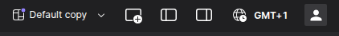
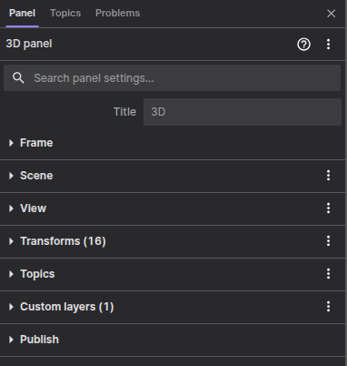
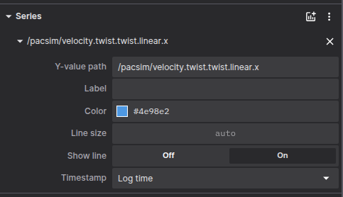

# Foglove

## Graphical 3D Visualization
Click on  that you find on the top-right corner of the Foxglove Studio window  to show the left sidebar.

### Show the track 
Open `Topics` and click the eye icon next to `/pacsim/track/visualization` to show the track.
You can also visualize the pointcloud by clicking the eye icon next to `/pacsim/perception/lidar_pcd`.

### Show the car 3D model
Open `Topics` and click the eye icon next to `robot_description`.

Troubleshooting: If the car looks weird, open `scene` and set `Mesh-up axis` to `Z-up`. (conventions on axis are different form rviz)

## Add plots
Click on the  that you find on the top-right corner of the Foxglove Studio window  to add new panel.

Select `plot` to add a new plot panel.

Click on the panel that appears, and on the left sidebar you can select the topics you want to plot. (e.g. velocity, steering angle, etc)
